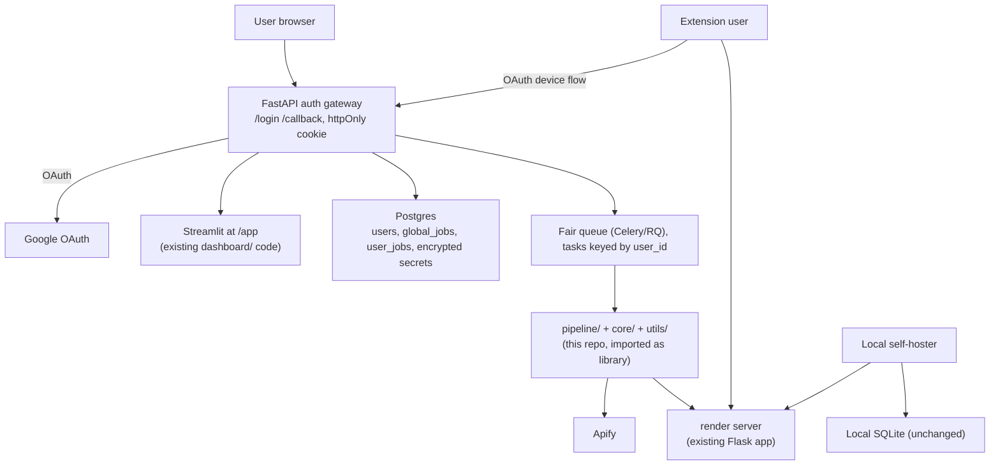
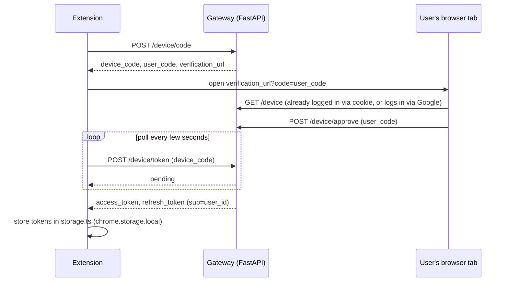
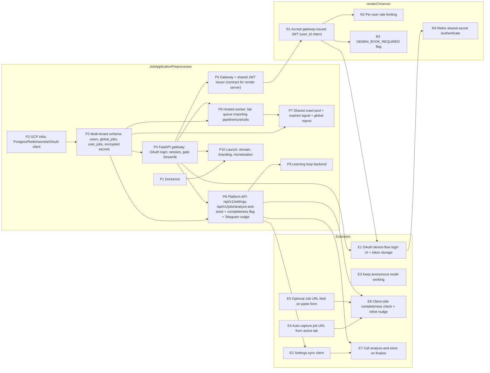

# job-fitr.ai transition & deployment plan

**Status:** Agreed direction as of 2026-07-16. This is the canonical, chronologically-ordered roadmap for turning the three existing projects (this Preprocessor, the render server, and the browser extension) into the multi-tenant job-fitr.ai SaaS sketched in `DECISIONS.md` and `items/`. An identical copy of this document lives in the render server and extension repos so an agent working in any one of the three has full cross-repo context.

## What exists across the three repos

- **This repo (`JobApplicationPreprocessor`)** — local-first Python pipeline (Apify + Gemini) + Streamlit dashboard, single-tenant SQLite (`local_storage.py`), calls a remote server for resume/CL/tailoring via `SERVER_URL`/`API_KEY` (`api_methods.py`).
- **`AI-job-search-helper-renderCVserver`** (sibling repo) — Flask server on GCP (Cloud Build → Artifact Registry), Redis rate limiting. Auth is **one shared secret** (`EXTENSION_SECRET`) → JWT with a fixed subject `extension-user` — no real per-user accounts yet. BYOK for Gemini is already partially wired: every endpoint accepts an optional `gemini_api_key` (`app.py` `get_llm()`), falling back to a dev key.
- **`AI-job-search-helper`** (browser extension, sibling repo) — Manifest V3, Vite + TS + React, 14 files / ~2.3k lines. Already has a `googleApiKey` field in `storage.ts`, sophisticated primary/fallback-model retry logic and 429 handling in `server-comms.ts`, PDF resume parsing, and a theme carousel. Its git remote is already renamed to `job-fit-ai-assistant`, so the rebrand is informally underway there.
- **`DECISIONS.md`** (this repo) is the living decision record that already answers most of the "open questions" in the individual `items/*.md` backlog files — treat it as the architecture source of truth, reconciled with the note below.

## Reconciled conflict: local-first vs. hosted

`DECISIONS.md` says "Web vs desktop: Replace local desktop app — web is primary." The agreed direction is instead to **keep both**: local-first stays available for power users/self-hosters, the hosted platform is the mass-market path. These aren't in tension engineering-wise — the hosted platform is built by importing this repo's existing `pipeline/`, `core/`, `utils/` modules as a library for a hosted worker, parameterized by `user_id` instead of global env vars, rather than forking the codebase. Whether the local installer eventually stops being published is a distribution decision, not an engineering one, and can be made later at near-zero extra cost.

## Extension: iterate, don't rewrite

The alternative considered was spinning up a new extension instead of evolving this one. Decision: **iterate**. Reasoning:

- `storage.ts` already isolates all persisted state behind `getUserData()`/`saveUserData()`. Adding `sessionToken`/`sessionTokenExpiry` fields next to the existing `googleApiKey` is additive.
- `server-comms.ts`'s `authenticate()` already does a token-fetch-and-cache dance for the shared-secret JWT. Swapping it for OAuth device-flow polling (per `DECISIONS.md`: "browser login → extension polls for token") replaces the body of one function, not the file's shape.
- `settings.ts` already has a working BYOK settings UI, PDF parsing, and theme management — a rewrite would mean re-implementing the dual-model 429-fallback logic, job-posting cache, and PDF text extraction for zero architectural gain.

A rewrite would cost multiple weeks re-implementing already-working, non-trivial logic to arrive at the same place.

## Target architecture

The gateway (OAuth login/callback, `/api/v1/*` platform API, session cookies) is a **new component that lives inside this Preprocessor repo**, not a 4th project — it needs to sit in front of this repo's own Streamlit dashboard and orchestrate this repo's own pipeline as a hosted worker, so colocating it avoids an extra deploy unit.

## Chronological phases

### Phase 0 — Reconcile & baseline (effort: S, ~2-3 days)
- Inventory current `.env`/secrets across all three repos; write down what must become per-user secrets (Apify token, Gemini key) vs. platform-owned secrets (`SERVER_URL`/`API_KEY` embedding, `EXTENSION_SECRET`, `JWT_SECRET_KEY`, Redis, DB creds).

### Phase 1 — Dockerize + GCP infra plan (item 30, effort: M, ~1 week)
- Dockerize this repo's pipeline + Streamlit (no Dockerfile exists yet, unlike the render server which already has one).
- Stand up Cloud SQL Postgres, decide Cloud Run vs. VM+Compose for the gateway/worker, provision Redis (render server already uses one — likely reusable), secrets manager for `ENCRYPTION_KEY`, OAuth client credentials.
- This unblocks every later hosted phase and is useful even for local dev parity.

### Phase 2 — Multi-tenant data model (items 02, 03 phase 1, effort: L, ~2 weeks)
- `users`, `user_settings`/`job_preferences` blob, encrypted BYOK secret storage (`ENCRYPTION_KEY`-based AES per `DECISIONS.md`).
- `global_jobs` catalog with TTL + `user_jobs` M2M visibility table; upsert into the global catalog on every Apify ingest (`pipeline/collection.py`).
- Build and test this against Postgres locally first — it's mostly additive to `local_storage.py`/`core/repository.py`, not a rewrite of them.

### Phase 3 — Auth gateway + hosted Streamlit (item 07, effort: L, ~2 weeks)
- New FastAPI service: `/login`, `/callback` (Google OAuth, `openid email profile`), httpOnly cookie, 7-day sessions.
- nginx (or Cloud Run routing) gates Streamlit at `job-fitr.ai/app`; unauthenticated → redirect to `/login`.
- Open signup; on first login, create `users` row + prompt for Apify key (required) and optional Gemini key (optional — platform quota by default).
- **The gateway becomes the single JWT issuer.** Today the render server mints its own JWT from a shared secret (`app.py` `/authenticate`). Once the gateway exists, it issues one JWT (signed with the same `JWT_SECRET_KEY`, `sub=user_id` instead of the constant `extension-user`) that is accepted by *both* the gateway's own API and the render server. The render server's `/authenticate` endpoint is retired for logged-in traffic (kept only as a deprecated fallback for old extension versions during rollout).

### Phase 4 — Render server multi-tenant hardening (effort: M, ~1 week)
- Replace the fixed JWT subject (`extension-user`) with real `user_id` claims once gateway issues tokens.
- Per-user rate limiting in `app.py`'s `Limiter` (currently keyed by a constant subject — every user currently shares one bucket).
- Feature flag `GEMINI_BYOK_REQUIRED` for a future hard cutover if platform Gemini spend gets too high.

### Phase 5 — Hosted background pipeline (effort: L, ~2-3 weeks)
- Fair-queue workers (Celery/RQ/ARQ) with tasks keyed by `user_id`, importing this repo's `pipeline/`, `core/`, `utils/` as a library instead of a `main.py` singleton loop.
- Per-search-query serial Apify (item 23, already done locally) carries over directly.
- Telegram notification path (already built) reused per-user.

### Phase 6 — Shared crawl pool + repost wiring (items 03 phase 2-3, 04, 05, 06 phase 3, effort: M, ~1-2 weeks)
- DB-first search step before hitting Apify (`core/sources/db_source.py`), falls back to Apify only for insufficient/stale hits.
- Global expired-signal table so one user's "expired" mark benefits everyone; repost-in-place already works locally (item 06 phases 1-2 done) — extend to the global catalog.

### Phase 7 — Extension auth + platform sync (item 09, effort: M, ~1-2 weeks)

**How the OAuth handshake connects the extension and the gateway:**

- This reuses the same JWT issuer as Phase 3 — the token the extension ends up with is the *same kind* of token the gateway and render server both accept, so no separate extension-only auth system is needed.
- **Connecting an account is optional, not required.** The extension keeps working exactly as it does today (local `googleApiKey`, shared-secret render-server auth) for anonymous users. "Connect account" is an upgrade path — once connected, centralized settings and cross-device sync switch on.

**Settings centralization — what moves to the web app vs. stays in the extension**, mapped to today's `storage.ts` `UserRelevantData` fields:

- Move to the platform account (Postgres, single source of truth, extension reads via a new gateway API, e.g. `GET/PATCH /api/v1/settings`):
  - `resumeJsonData`, `resumeFileName`/`resumeFileContent` — same resume data this repo's `resume_data.json` already represents; one upload, usable from the web dashboard, the extension, and the hosted pipeline.
  - `googleApiKey` (Gemini BYOK) — becomes an "API keys" section on the web account settings page (already planned for items 07/08). A connected extension stops asking for its own copy and just inherits it.
  - `linkedinSearchQuery` — derived from the resume; centralize so it's consistent everywhere it's used.
  - `privateDataLogging` — an account-level consent/legal setting, not a per-device one.
- Stay extension-local (`chrome.storage.local`), because they're device/session-scoped and gain nothing from centralizing:
  - `theme` / `currentThemeIndex` — cosmetic resume-preview preference.
  - `jobPostingCache` — the in-progress scratchpad (draft analysis, draft cover letter, retry feedback) for whatever job the user currently has open in the side panel. This is inherently ephemeral; it only becomes account data once the user finalizes it (see below).
  - `resumesDownloaded` — a local usage counter; if billing/analytics is wanted on this, count it server-side from API calls rather than trusting a client-reported number.
  - `modelName`/`fallbackModelName` — default from the account's platform settings, but allow a local override (some users may want a device-specific model choice).

**Data flow / sync strategy (deliberately simple for v1, no WebSocket):**
- **Pull on load:** extension fetches `GET /api/v1/settings` when the side panel opens (or on a timer), caches the response in `chrome.storage.local` so it still works offline/between syncs.
- **Push on change:** extension settings-save calls `PATCH /api/v1/settings` immediately; dashboard settings save writes directly to Postgres. Last-write-wins by server timestamp — no merge/CRDT logic needed at this scale.
- **Finalize, not draft, syncs to jobs:** the `jobPostingCache` scratch state stays local while a user is iterating on a cover letter or resume. Only when they're done (e.g. downloads the PDF, or explicitly saves) does the extension call the item 13 `POST /api/v1/jobs/analyze-and-store` endpoint, which is what actually writes a row into the shared multi-tenant `global_jobs`/`user_jobs` tables from Phase 2. This avoids spamming the DB with half-finished drafts and sidesteps most of item 09's "conflict resolution" question (dashboard vs. extension racing to update the same job) since the extension only writes once, on finalize.

### Phase 8 — Extension feature parity with platform (items 13, 14, 31, 33, 34, effort: M, ~1-2 weeks)
- Analyze-to-DB: new authenticated ingest endpoint (`POST /api/v1/jobs/analyze-and-store`) so extension-analyzed jobs land in the same multi-tenant DB as the pipeline.
- Smaller UX polish items (API key error deep-links, uninstall survey, text sizing) — low effort, can slot in opportunistically.

**Sub-requirement: job URL capture + data-completeness nudge.** A job row is only useful to the shared pipeline/dashboard workflow if it has the fields `core/models.Job`/`utils/schema.JOB_COLUMNS` actually need (`Job Title`, `Company Name`, `Job URL`, `Job Description`, `Location`). The extension today analyzes selected text but doesn't reliably capture the source URL, and the manual paste flow has no page context at all. Concretely:
- **Auto-capture the job URL:** when analysis is triggered via context menu, keyboard shortcut, or toolbar on an actual job page, read the active tab's URL (`chrome.tabs.query`) alongside the selected text and carry it through `jobPostingCache` to the eventual store call.
- **Optional URL field on the manual-paste form:** when the user pastes raw text into the side panel instead of triggering from a page, add an optional "Job URL" input so the row still has a URL if the user has one to give (e.g. copied from an email or job board they didn't run the extension on directly).
- **Completeness check before/at store time:** when `POST /api/v1/jobs/analyze-and-store` is called, validate the payload against the required-field set above. If anything is missing (most commonly the URL, from a paste with no URL supplied), still create the row but set a new `Missing data` flag (and which fields, e.g. `Missing fields: Job URL`) — mirroring the existing boolean-flag style of `Bad analysis`/`Job posting expired` in `utils/schema.py`.
- **Nudge the user to complete it:** surface `Missing data` rows in the dashboard (new filter/badge, same pattern as existing `Bad analysis`/expired filters in `dashboard/filters.py`). Additionally, reuse the existing Telegram bot (`utils/telegram_bot.py`) to nudge the user directly — if a given notification cycle has nothing else to send (no ready application packages, no other alerts), send the "you added a job that's missing its URL/description — tap to complete" message instead of staying silent that cycle.

### Phase 9 — Learning loop (items 10, 11, 18, 19, effort: L, ~2-3 weeks)
- Requires multi-tenant DB (Phase 2) and editable prompts (item 15, already shipped in this repo) to be meaningful.
- Ship "approval" mode first (safer default), vibe/auto-apply mode second, per `DECISIONS.md`.

### Phase 10 — Public launch (items 20, 01 phase 3, 12, effort: M, ~1 week + ongoing)
- DNS/domain cutover to `job-fitr.ai`, marketing landing page, Buy Me a Coffee on the hosted UI, visual branding pass across all three repos.
- Item 32 (additional job platforms) is exploratory research, not launch-blocking — track separately.

## Per-project breakdown with dependencies (for orchestrating agents)

Each step below has an id, which repo owns it, and explicit upstream dependencies (including cross-repo ones) so agents can be dispatched in parallel where there's no dependency edge between them.

### JobApplicationPreprocessor (owns: data model, gateway, hosted worker, platform API, Telegram nudge)
- **P1** Dockerize pipeline + Streamlit (item 30). *Depends on: nothing.*
- **P2** GCP infra — Cloud SQL Postgres, Redis (or reuse render server's), secrets manager, Google OAuth client credentials. *Depends on: nothing; can run parallel with P1.*
- **P3** Multi-tenant schema — `users`, `global_jobs`, `user_jobs`, encrypted BYOK secrets (items 02, 03p1). *Depends on: P2.*
- **P4** FastAPI gateway — `/login`, `/callback`, session cookie, gates Streamlit at `/app` (item 07). *Depends on: P3 (needs `users` table), P2 (OAuth client creds).*
- **P5** Gateway becomes the single JWT issuer (same `JWT_SECRET_KEY`, `sub=user_id`) — defines the contract renderCVserver's R1 consumes. *Depends on: P4. Blocks: R1.*
- **P6** Hosted worker / fair queue importing `pipeline/`, `core/`, `utils/` as a library, keyed by `user_id`. *Depends on: P3, P4.*
- **P7** Shared crawl pool DB-first search, global expired signal, global repost (items 03p2-3, 04, 05, 06p3). *Depends on: P3, P6.*
- **P8** Platform API — `GET/PATCH /api/v1/settings`, `POST /api/v1/jobs/analyze-and-store` with required-field validation, new `Missing data`/`Missing fields` columns (`utils/schema.py`), dashboard nudge filter, Telegram nudge via existing `utils/telegram_bot.py` (item 13 + completeness sub-requirement). *Depends on: P3, P4. Blocks: extension's E2, E6, E7.*
- **P9** Learning loop backend (items 10, 11, 18, 19). *Depends on: P3; item 15 already shipped.*
- **P10** Launch — domain cutover, branding pass, monetization (items 20, 01p3, 12). *Depends on: P1, P4 (needs something deployed to cut over to).*

### renderCVserver (owns: LLM proxy hardening, becomes account-aware)
- **R1** Accept gateway-issued JWT instead of self-minted shared-secret token; `app.py`'s `get_jwt_user_id()` now returns a real `user_id`. *Depends on: Preprocessor's P5 (needs the exact secret/claim contract).*
- **R2** Per-user rate limiting in `Limiter` (currently one shared bucket via the constant `extension-user` subject). *Depends on: R1.*
- **R3** `GEMINI_BYOK_REQUIRED` feature flag for a future hard BYOK cutover. *Depends on: R1 (soft — meaningful once real per-user identity exists, but can be stubbed earlier).*
- **R4** Retire the shared-secret `/authenticate` path (deprecate; keep temporarily for extension versions mid-rollout). *Depends on: R1 and Extension's E1 (don't retire until the extension can actually use the new flow).*

### Extension (owns: OAuth client, settings sync client, job-capture UX)
- **E1** OAuth device-flow login screen + token storage/refresh (`storage.ts`, `server-comms.ts`). *Depends on: Preprocessor's P4 (gateway must expose `/device/code`, `/device/token`) and renderCVserver's R1 (token must already be accepted server-side). Blocks: R4.*
- **E2** Settings sync client (pull on load, push on change against `/api/v1/settings`). *Depends on: Preprocessor's P8.*
- **E3** Keep anonymous mode fully working (local `googleApiKey`, legacy render-server auth) as the default when no account is connected. *Depends on: nothing — mostly already true, just needs to stay true.*
- **E4** Auto-capture job URL from the active tab on trigger. *Depends on: nothing — can ship standalone, ahead of the auth work.*
- **E5** Optional "Job URL" field on the manual paste-text form. *Depends on: nothing — pairs naturally with E4 but no hard dependency.*
- **E6** Client-side completeness check + inline "missing: X" nudge before submit. *Depends on: E4, E5 (needs the URL to check), and Preprocessor's P8 (needs the required-field contract).*
- **E7** Call `analyze-and-store` on finalize (not on every draft keystroke) (item 13). *Depends on: E2 (auth to call the platform API) and Preprocessor's P8.*

### Suggested parallelization for agent orchestration
- **Wave 1 (no cross-repo deps, can start immediately in parallel):** P1, P2, E3, E4, E5.
- **Wave 2:** P3 (after P2); E6 can start once E4/E5 land, using a stubbed/mocked required-field contract until P8 is real.
- **Wave 3:** P4 (after P3); P6, P7 can follow P3 independently of P4's OAuth details.
- **Wave 4:** P5 → R1 (cross-repo handoff — this is the one hard serialization point between Preprocessor and renderCVserver) → R2, R3.
- **Wave 5:** P8 (after P3+P4) → E1 (after P4+R1) → E2, E7 → R4 (after E1 ships).
- **Wave 6:** P9, P10.

## Rough total estimate

Phases 0-4 (foundation, data model, auth, server hardening) are the critical path and gate everything else: roughly **6-8 weeks** solo, part-time. Phases 5-10 can partially overlap once the foundation lands; full feature parity (learning loop, extension sync, launch) is realistically another **8-12 weeks** after that. Treat all sizes as rough t-shirt estimates, not commitments — the individual backlog items under `items/` have more granular phase breakdowns to re-estimate against as you go.
